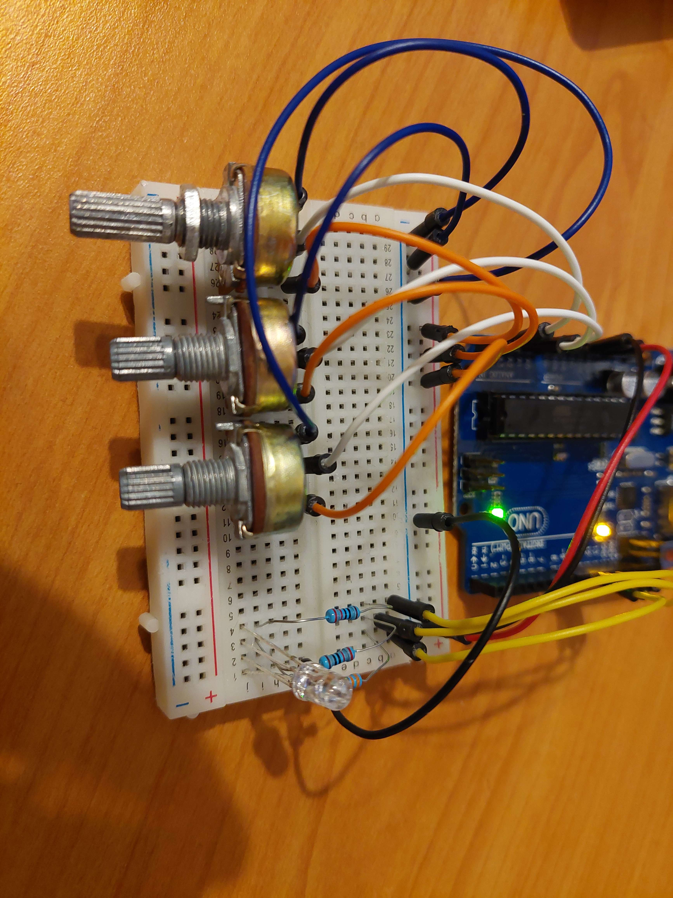
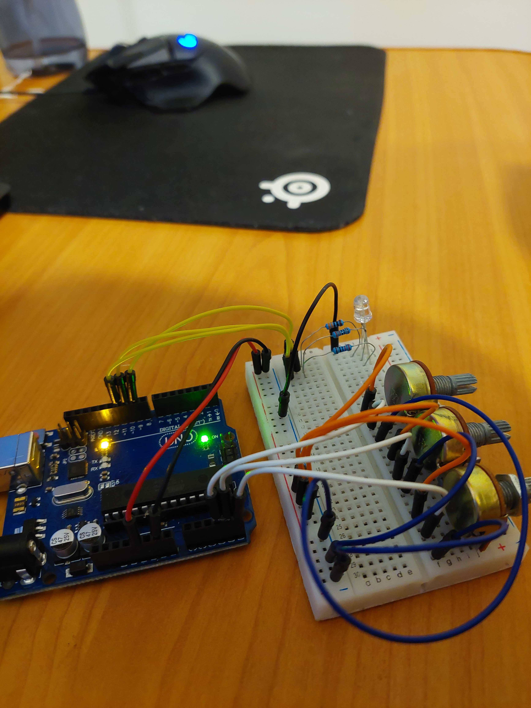

## Homework 2 - RGB LED control using potentiometers

For this homework we had to create a circuit and an Arduino program to control each color of an RGB LED using a potentiometer. Here is a video of it working:

### Objectives:
- Learn how to use potentiometers to control the brightness of each channel of an RGB LED
- Get used to Arduino IDE and Arduino UNO board
- Get used to the breadboard and the wiring of the circuit
- Learn how to program the Arduino to read and write analog values

### Materials:
- Arduino UNO
- 3 potentiometers
- 1 220 ohm resistor (red LED)
- 2 330 ohm resistors (green and blue LEDs)
- 1 RGB LED (common cathode)
- 1 breadboard
- wires

### Procedure:
1. Setup the circuit as shown in the figure below. 
    - Connect the 5V pin of the Arduino to the positive rail of the breadboard.
    - Connect the GND pin of the Arduino to the negative rail of the breadboard.
    - Connect the GND rail to the negative pin of the RGB LED.
    - Connect the positive pin of each channel of the RGB LED to their respective resistors.
    - Connect the other end of the resistors to the digital pins 9, 10, and 11 of the Arduino. (for PWM output)
    - Connect the middle pin of each potentiometer to the analog pins A5, A4, A3 of the Arduino.
    - Connect the other pins of the potentiometers to the positive and negative rails of the breadboard.

    
    

2. Open the Arduino IDE and use the sketch in the file [RGB_LED_potentiometer.ino](RGB_LED_potentiometer/RGB_LED_potentiometer.ino) to program the Arduino.
3. Upload the sketch to the Arduino and observe the behavior of the RGB LED as you turn the potentiometers.
