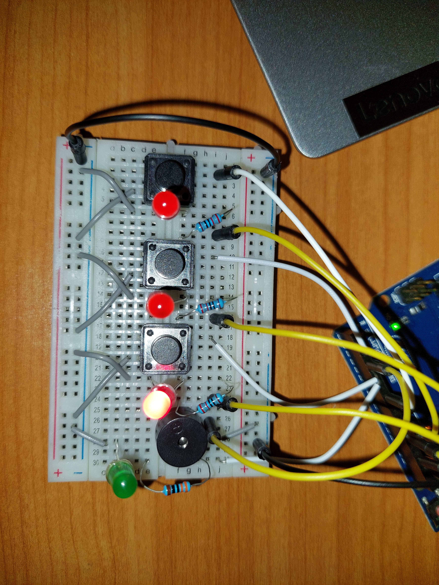
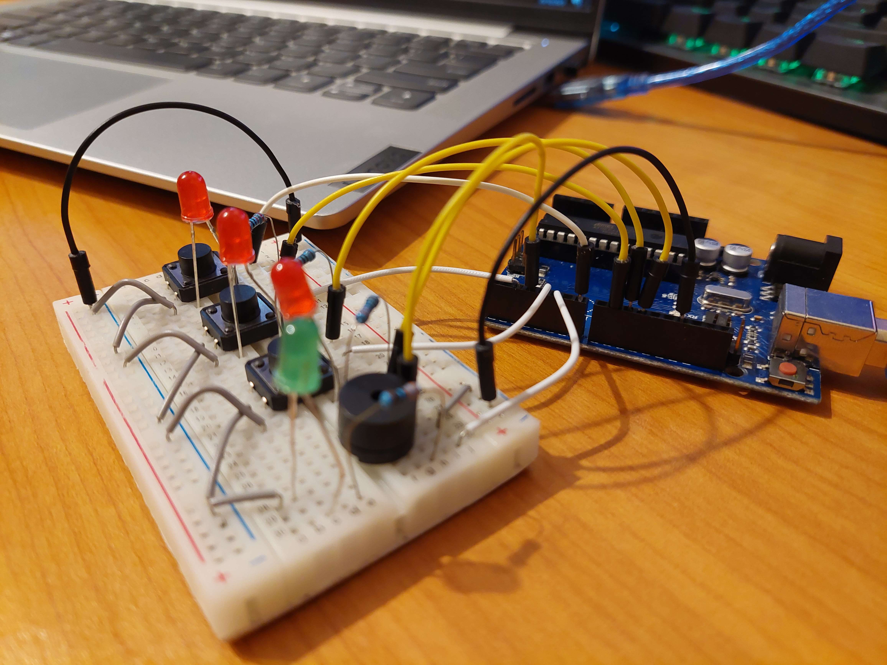

## Homework 3 - Elevator simulator using LEDs and buttons

This homework asked us to recreate an elevator using buttons to choose a floor and LEDs to show which floor it was currently on (also while moving).

Here it is working:

### Objectives:

- Make a functioning elevator using LEDs to show floors
- Use a buzzer to semnify that he elevator is moving or that the doors are closing/opening
- Learn about button debounce and how to implement it

### Materials:

- Arduino UNO
- 3 red LEDs
- 3 220 Ohm resistor (red LED)
- 1 green LED
- 1 330 Ohm resistor (green LED)
- 3 buttons
- 1 buzzer
- 1 breadboard
- wires

### Code and difficulties:

The main difficulty was adding the doors closing sound at the start of the "movement", because the moving sound had to be delayed. I had to create another variable to remember when the button was pressed and use the millis() function, so that I would avoid using the delay() function.

One other difficulty was implementing the button debounce for 3 buttons, but I managed to do it by modifying the code from the lab.

https://github.com/Robstoner/intro-to-robotics/blob/892bb0a2a25fae186251add0c921087120585a55/Homeworks/Homework3/elevator/elevator.ino#L1-L132

### Procedure:

1. Setup the circuit as shown in the pictures below:
   - Connect the GND pin on the Arduino to the negative rail of the breadboard
   - Connect the negative rails of the breadboard togheter
   - Connect all 3 buttons to GND on one side of them
   - Connect each of the 3 buttons to a digital pin on the opposite side of the GND pin
   - Connect all 4 LEDs to GND and to their specific resistor
   - Connect each resistor from the LED to a digital pin on the Arduino
   - Connect the buzzer to GND and to a digital pin on the Arduino
2. Open the Arduino IDE and use the sketch in the file [elevator.ino](elevator/elevator.ino) to program the Arduino.
3. Upload the sketch to the Arduino and press the buttons to move the elevator to that specific floor, by turning off and on the corresponding LED.

