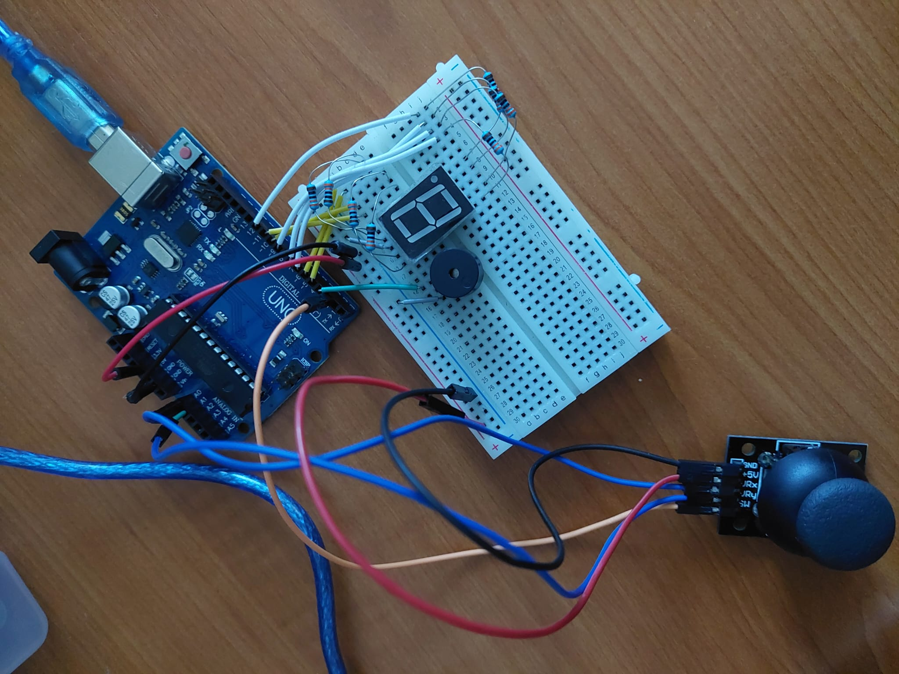
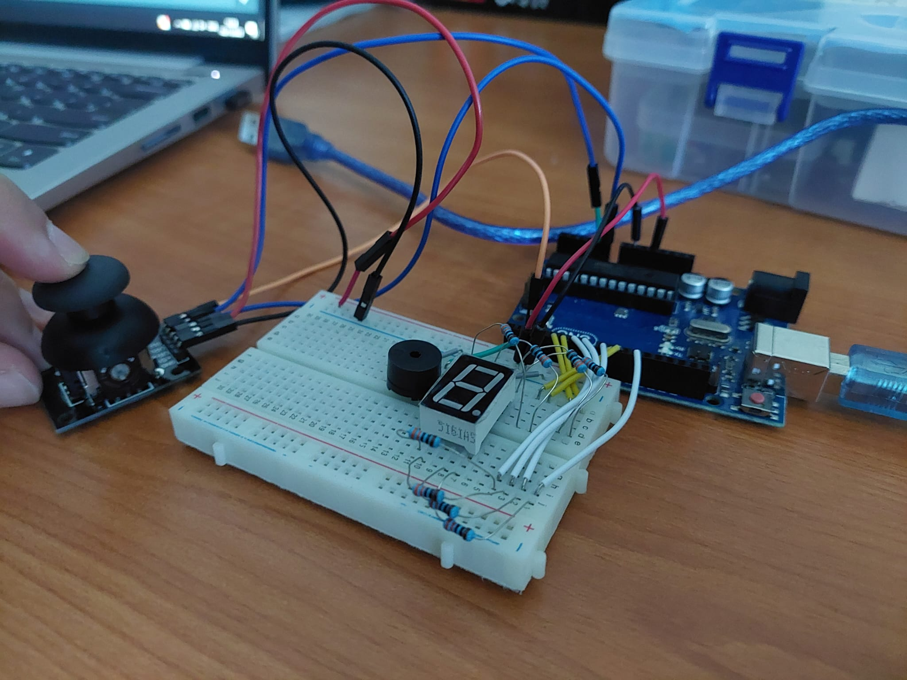
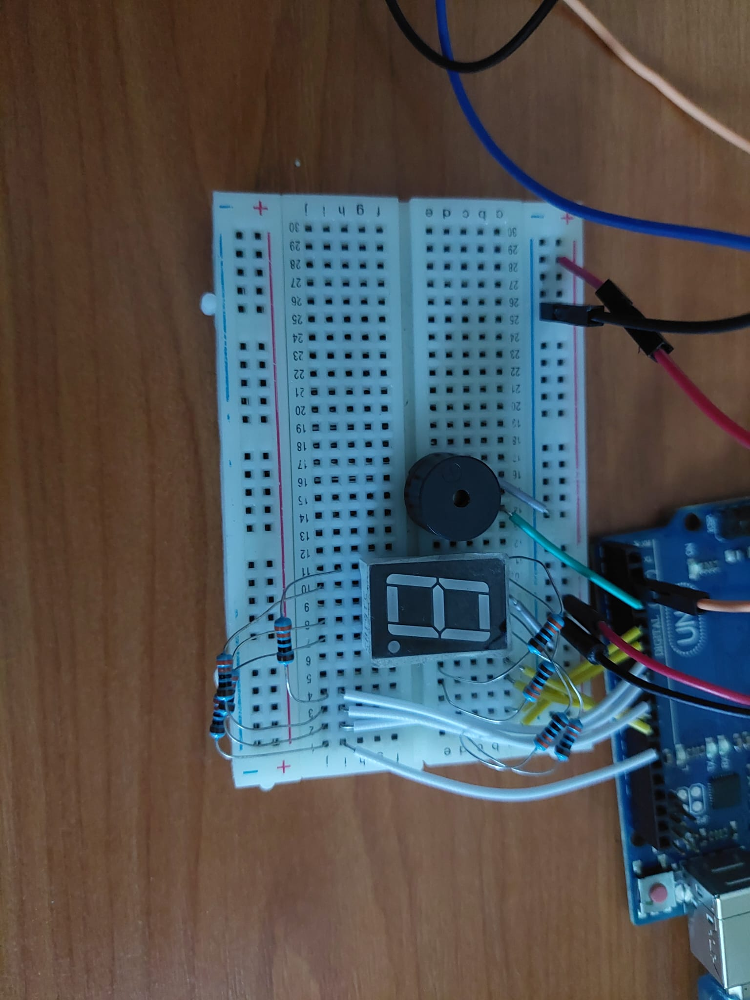

## Homework 3 - 7 segment display drawing

This homework asked us to move and draw on a 7 segment display using a joystick.

Here it is working:

### Objectives:

- Move between the segments using the joystick
- Blink the current segment
- Toggle each segment on and off using the joystick button
- Reset all segments to off using the joystick button long press
- Use interrupts

### Materials:

- Arduino UNO
- 1 seven segment display
- 8 330 ohm resistors
- 1 joystick
- 1 buzzer
- 1 breadboard
- wires

### Code and difficulties:

The biggest difficulty for this homework was making the interrupt work. I had to use the CHANGE interrupt so that I could get both RISING and FALLING interrupts, 
for a toggle and for when the button is depressed, to check if it was a long press.
I also had to apply debounce to it so that it wouldn't trigger multiple times when I would want it to only toggle once. Unfortunately the debounce is not working
perfectly (you can see it in the video on the top-left segment pressing twice), though it is working well enough.

I also added a buzzer to the circuit so that it would beep when a segment was toggled and when the reset button was pressed.

https://github.com/Robstoner/intro-to-robotics/blob/d2218d01533ada84bc9ef81b28c876aa926a8f63/Homeworks/Homework4/Joystick_Controlled_7SegmDisplay/Joystick_Controlled_7SegmDisplay.ino#L1-L299

### Procedure:

1. Setup the circuit as shown in the pictures below:
   - Connect the GND pin on the Arduino to the negative rail of the breadboard
   - Connect the 5V pin on the Arduino to the positive rail of the breadboard
   - Connect the GND pin on the 7 segment display to the negative rail of the breadboard
   - Connect each segment on the 7 segment display to a resistor
   - Connect each resistor to a digital pin on the Arduino
   - Connect the joystick to the positive and negative rails of the breadboard
   - Connect the joystick potentiometer pins to the analog pins on the Arduino
   - connect the joystick button pin to a digital pin on the Arduino that supports interrupts
   - Connect the buzzer to GND and to a digital pin on the Arduino
2. Open the Arduino IDE and use the sketch in the file [Joystick_Controlled_7SegmDisplay.ino](Joystick_Controlled_7SegmDisplay/Joystick_Controlled_7SegmDisplay.ino) to program the Arduino.
3. Upload the sketch to the Arduino and move through the segments using the joystick, toggling them on or off with the joystick's button. Long press the button to reset all the segments to off.

   
   
   

