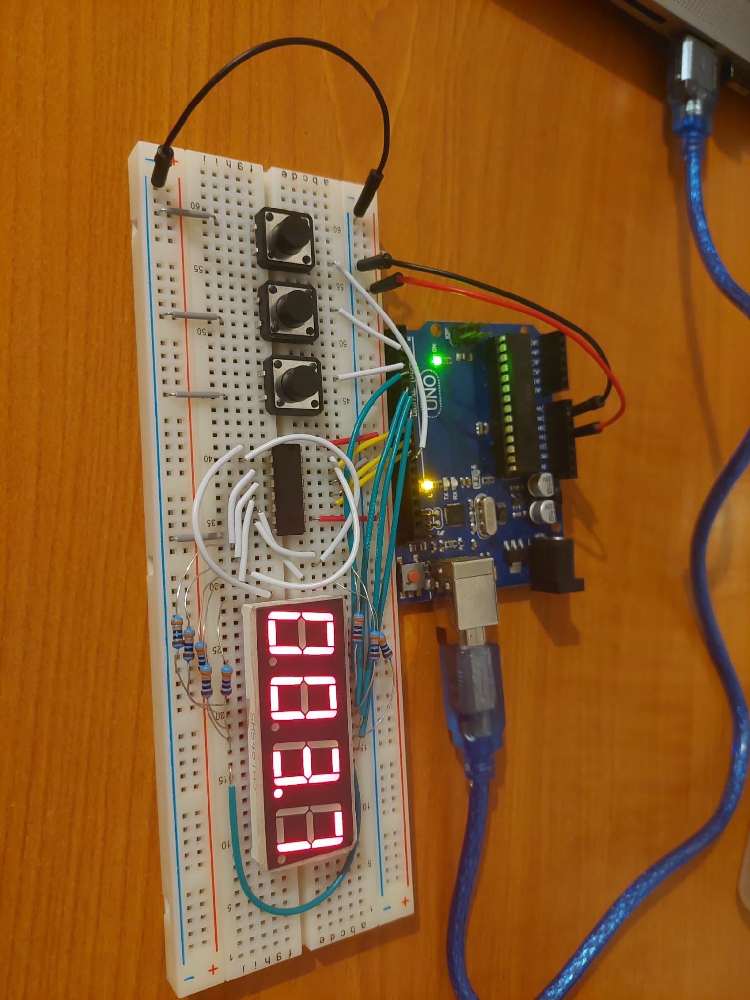
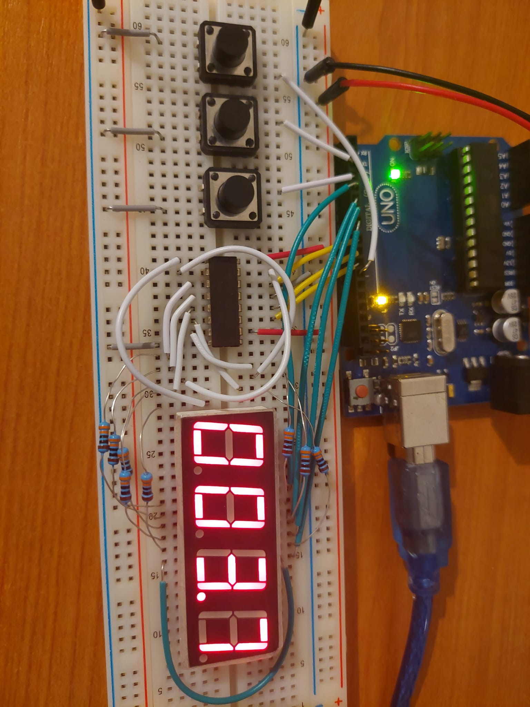

## Homework 3 - Stopwatch on 4 bit 7 segment display

This homework asked us to make a stopwatch using a 4 bit 7 segment display and 3 buttons.
The stopwatch should be able to start, stop, reset, save lap times and show the last 4 saved lap times.

Here it is working:

### Objectives:

- Learn to use the Shift Registor to use less pins on the arduino
- Make a functioning stopwatch
- Get used to better coding practices and style
- Use interrupts correctly (still not perfected)

### Materials:

- Arduino UNO
- 1 four digit seven segment display
- 8 330 ohm resistors
- 1 shift registor
- 3 buttons
- 1 breadboard
- wires

### Code and difficulties:

The main idea of this homework was relatively simple, and didn't need a lot of time to implement, 
but I ran into a lot of problems with the interrupts double clicking or not clicking at all, and with the lap times not being shown when they should be.
Unfortunately I didn't manage to fix the double clicking, especially for lap save button, but the rest works well.

### Procedure:

1. Setup the circuit as shown in the pictures below:
   - Connect the GND pin on the Arduino to the negative rail of the breadboard
   - Connect the 5V pin on the Arduino to the positive rail of the breadboard
   - Connect the D1-4 pins of the 7 segment display to the Arduino
   - Connect the A-G pins of the 7 segment display to the shift register
   - Connect the shift register DS, SHCP and STCP pins to the arduino
   - Connect the shift register to the positive and negative rails of the breadboard
   - Connect the buttons to the negative rail, and to digital pins on the Arduino (lap save and pause/start button to interrupt pins)
2. Open the Arduino IDE and use the sketch in the file [Stopwatch_4bit_7segm.ino](Stopwatch_4bit_7segm/Stopwatch_4bit_7segm.ino) to program the Arduino.
3. Upload the sketch to the Arduino and 

   
   

