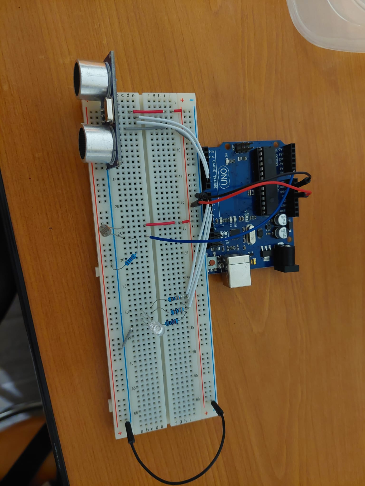
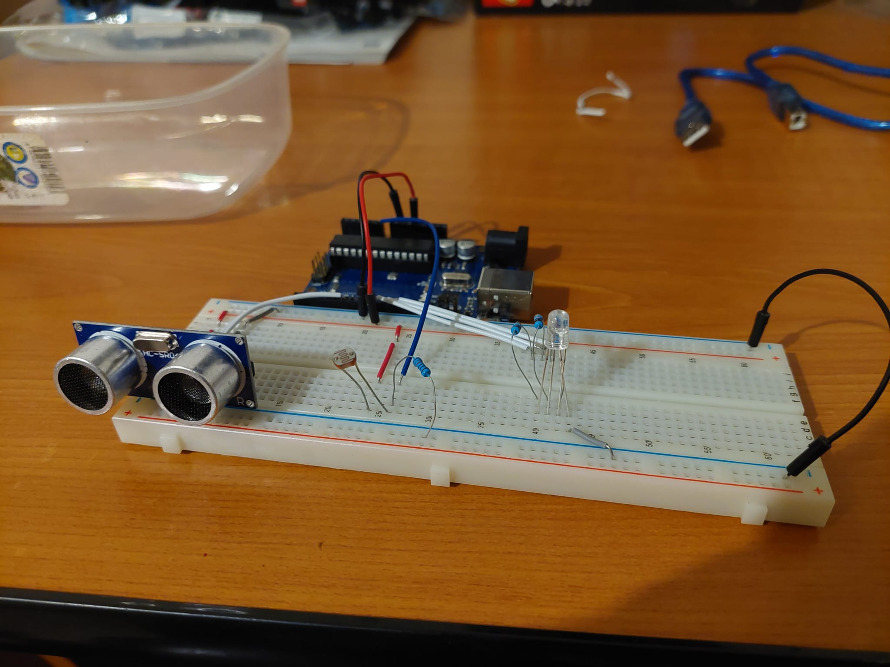

## Homework 3 - Smart Environment Monitor and Logger

This homework asked us to create a program which would log data from 2 different sensors, an ultrasonic sensor and a light sensor, and use an RGB LED to show the status of the environment.
It also includes a complex menu system, which allows the user to change the settings of the program, such as the threshold for the ultrasonic sensor, the threshold for the light sensor, switch the LED from automatic mode to manual mode, and change the color of the LED in manual mode.
You can also see the logged data through the menu, reset it, and continously view the current status of the environment.

Here it is working:

### Objectives:

- Create a complex menu system
- Accept inputs from the user while other things are also running
- Log data from 2 different sensors
- Use an RGB LED to show the status of the environment

### Materials:

- Arduino UNO
- 1 ultrasonic sensor
- 1 RGB LED
- 2 330 ohm resistors (green and blue channels of the LED)
- 1 220 ohm resistor (red channel of the LED)
- 1 Light-Dependent Resistor (LDR)
- 1 10k ohm resistor (LDR)
- 1 breadboard
- wires

### Code and difficulties:

This homework was not extremely hard, but reading inputs while also logging data and having a menu was a bit of a hassle. 
I had to use quite a few bool variables to check the different states of the program and do different things accordingly.
Also, because of the many different options, submenus and inputs, I had to use a lot of switch cases and ifs, which made the code a bit hard to read.
In retrospect, the chooseOption function could have been switched around, with 4 ifs and 4 different switch cases, but I felt like my option was better at the start and stuck with it.

https://github.com/Robstoner/intro-to-robotics/blob/dd19a57db5325efa0c7b7a426afbe0329ed60205/Homeworks/Homework6/Smart_Environment_Monitor_and_Logger/Smart_Environment_Monitor_and_Logger.ino#L1-L491

### Procedure:

1. Setup the circuit as shown in the pictures below:
   - Connect the GND pin on the Arduino to the negative rail of the breadboard
   - Connect the 5V pin on the Arduino to the positive rail of the breadboard
   - Connect the the ultrasonic sensor to the negative and positive rail of the breadboard
   - Connect the ultrasonic sensor's trigger and echo pin to digital pins on the arduino
   - Connect the LDR to the positive rail of the breadboard
   - Connect the LDR to the negative rail of the breadsboard through a 10k ohm resistor, and to an analog pin on the Arduino on the same column
   - Connect the RGB LED to the negative rail of the breadboard
   - Connect the three channels of the RGB LED to digital pins on the Arduino through resistors
2. Open the Arduino IDE and use the sketch in the file [Smart_Environment_Monitor_and_Logger.ino](Smart_Environment_Monitor_and_Logger/Smart_Environment_Monitor_and_Logger.ino) to program the Arduino.
3. Upload the sketch to the Arduino and use the menu to navigate through the different options. Put something in front of the ultrasonic sensor, or cover the light sensor, to see the automatic LED change from green to red. Change the settings using the menu, and they will remain saved even after the Arduino is turned off.

   
   

