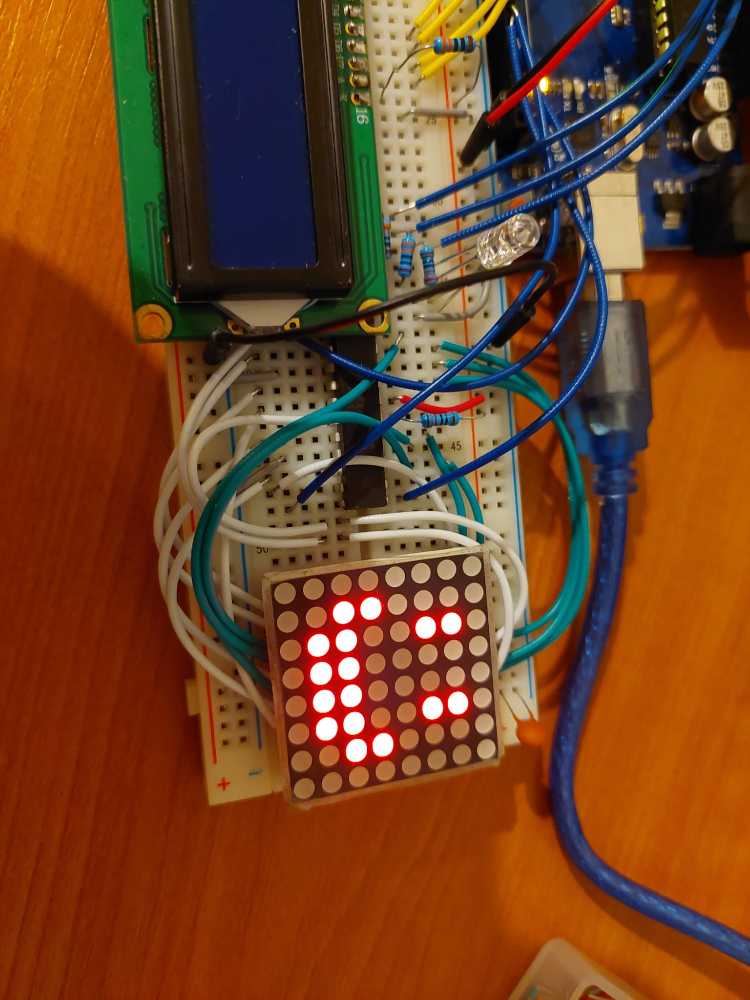
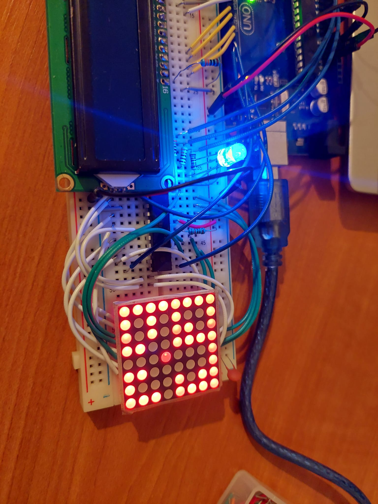
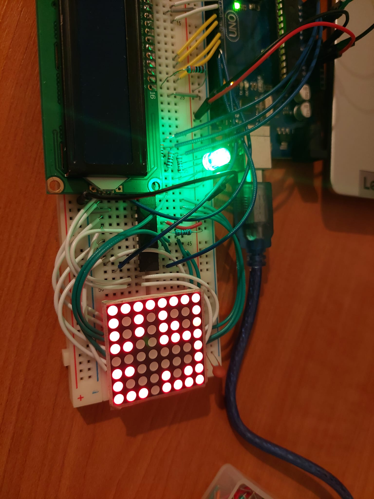
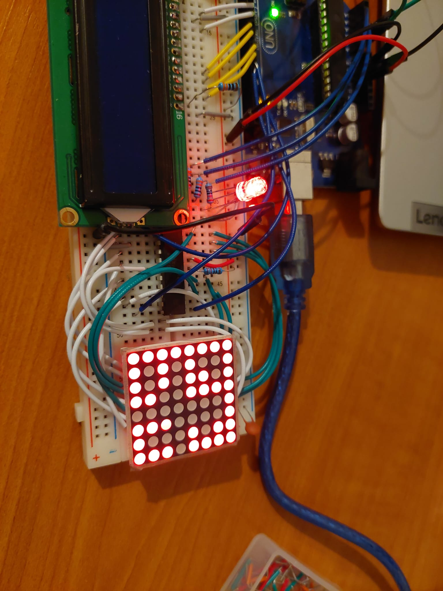

## Homework 7 - Game on an 8x8 matrix

This homework asked us to make a game on an 8x8 matrix using the Arduino and a joystick.

I decided to make a game with multiple rooms, obstacles and hidden treasures. 
The goal is to find all the treasures in the least amount of time possible, or to run out of shovels on the way.
The RGB LED shows the proximity of a treasure, and the joystick is used to move around the map and dig up treasures.

Here it is working:

### Objectives:

- Learn to use the 8x8 matrix and the MAX7219 driver
- Create a more complex project using the Arduino
- Get used to better coding practices and style

### Materials:

- Arduino UNO
- 1 8x8 matrix
- 1 MAX7219 driver
- 1 joystick
- 1 RGB LED
- 1 breadboard
- wires

### Code and difficulties:

The hardest part of this homework was coming up with a game that would be fun to play on an 8x8 matrix.

   
   
   
   

